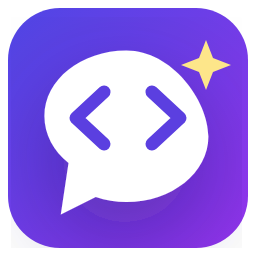

<div align="center">



# Stoat

**Small agent. Takes on the big ones.**

An open-source AI coding agent for VS Code. Bring your own model; review every change.

[Website & guides](https://alialalawi14.github.io/stoat/) ·
[Install from the VS Code Marketplace](https://marketplace.visualstudio.com/items?itemName=AliAlalawi14.stoat) ·
[Open VSX (Cursor, Windsurf, VSCodium)](https://open-vsx.org/extension/AliAlalawi14/stoat) ·
[Report a bug](https://github.com/AliAlalawi14/stoat/issues)

</div>

<!-- Demo GIF: docs/demo.gif — ask → the agent edits several files → review bar → Keep all -->

Stoat is a coding agent in your VS Code sidebar. It reads your project, plans features with you,
edits files and runs your build and tests. When it's done, you **Keep or Undo** each change.

- **Any model**: Claude, GPT, Gemini, DeepSeek, Mistral, Grok, OpenRouter, Azure OpenAI, any OpenAI-compatible API, or **local models** through Ollama / LM Studio.
- **No subscription, no account, no telemetry**: you use your own API key and pay only the provider, or run fully offline with a local model.
- **Review after, not approve before**: the agent works without stopping at every file; you get a Cursor-style review with Keep/Undo per edit, per file, or all at once.
- **Plan mode**: clarifying questions first, then an editable Markdown plan that **Build** follows and ticks off.
- **Zero setup**: the engine ships inside the extension and starts by itself. No Python, no .NET, no Docker.
- **Measured, not claimed**: every change runs through an eval gate of real tasks against a real model, 3 runs each ([`Ai-Agent/evals`](Ai-Agent/evals)). Current baseline: **26/26 tasks pass every run**.

## Why "Stoat"?

A stoat weighs about 200 grams and routinely takes on rabbits ten times its size. Stoat is a small, open-source
agent built to compete with the big, closed ones: no subscription, no lock-in, any model, every change yours to keep or undo.

## Install

| Editor | Where |
|---|---|
| **VS Code** | Extensions view → search **Stoat**, or the [Marketplace page](https://marketplace.visualstudio.com/items?itemName=AliAlalawi14.stoat) |
| **Cursor, Windsurf, VSCodium** | Extensions view → search **Stoat** ([Open VSX](https://open-vsx.org/extension/AliAlalawi14/stoat)) |
| **Offline / specific version** | Download the `.vsix` for your platform from [Releases](https://github.com/AliAlalawi14/stoat/releases), then *Extensions → … → Install from VSIX* |

Then open a folder, click the Stoat icon, connect a model in the panel, and ask away.
The full user guide is on the [extension page](ai-chat-extension/README.md).

## How it works

```
┌──────────────────────── your machine ─────────────────────────┐
│  VS Code                                                       │
│  ┌──────────────────────┐   postMessage   ┌─────────────────┐  │
│  │ Chat panel (React)   │ ◄─────────────► │ Extension (TS)  │  │
│  └──────────────────────┘                 └───────┬─────────┘  │
│                                    starts & talks │ HTTP + SSE │
│                                  (127.0.0.1, token)│            │
│                                   ┌───────────────▼──────────┐ │
│                                   │ Agent backend (.NET)     │ │
│                                   │ agent loop · tools ·     │ │
│                                   │ change log · plan files  │ │
│                                   └───────┬──────────┬───────┘ │
│                         reads/edits files │          │         │
│                      (open folder only)   ▼          │         │
│                                     your project     │         │
└──────────────────────────────────────────────────────┼─────────┘
                                                       ▼
                          Claude / GPT / Gemini / … with your key,
                          or Ollama / LM Studio on the same machine
```

- The **extension** starts a self-contained backend per VS Code window on a free localhost port with a random token, and passes it your keys from VS Code's secret storage.
- The **backend** runs the agent loop: it calls the model, executes tools (read, search, edit, run allow-listed commands), records every file change as a patch so it can be undone, and streams everything to the panel.
- **Safety**: workspace-only file access, no shell for commands, secret redaction, approvals for commands. See [SECURITY.md](SECURITY.md).

## Repository layout

| Folder | What |
|---|---|
| [`ai-chat-extension/`](ai-chat-extension) | The VS Code extension (TypeScript) and its chat panel (`webview-ui/`, React + Tailwind) |
| [`Ai-Agent/Ai-Agent/`](Ai-Agent/Ai-Agent) | The agent backend (ASP.NET Core, .NET 10): agent loop, tools, providers, change tracking ([details](Ai-Agent/README.md)) |
| [`Ai-Agent/Ai-Agent.Tests/`](Ai-Agent/Ai-Agent.Tests) | Backend tests (xUnit) |
| [`Ai-Agent/Ai-Agent.Evals/`](Ai-Agent/Ai-Agent.Evals) · [`Ai-Agent/evals/`](Ai-Agent/evals) | The eval runner and its tasks |
| [`scripts/`](scripts) | `publish-backend` bundles the backend into the extension for one platform |

## Build from source

Requirements: [.NET 10 SDK](https://dotnet.microsoft.com/download), Node.js 20+, VS Code.

```bash
git clone https://github.com/AliAlalawi14/stoat.git
cd stoat

# 1. Backend tests
dotnet test Ai-Agent

# 2. Bundle the backend for your platform (win-x64, linux-x64, osx-arm64, osx-x64)
./scripts/publish-backend.ps1            # Windows
./scripts/publish-backend.sh linux-x64   # macOS / Linux

# 3. Extension + chat panel
cd ai-chat-extension
npm ci && (cd webview-ui && npm ci)
npx @vscode/vsce package --target win32-x64   # or linux-x64, darwin-arm64, darwin-x64
code --install-extension stoat-*.vsix
```

**Developing**: open `ai-chat-extension` in VS Code and press `F5` to launch an Extension Development Host.
To debug the backend, run it yourself (`dotnet run --project Ai-Agent/Ai-Agent`) and set `aiChat.backendUrl`
to its URL; the extension then uses it instead of the bundled one.

**Before a pull request**: run `dotnet test Ai-Agent`, and for changes to the agent's behaviour the eval gate
(see [Measuring changes](Ai-Agent/README.md#measuring-changes-eval-gate)), and compare with the baseline.

## Contributing

Issues and pull requests are welcome. Good first contributions: new provider presets, language-specific build and
test detection, and docs. For larger changes, open an issue first so we can agree on the approach.

Security problems: please don't open a public issue; see [SECURITY.md](SECURITY.md).

## License

[MIT](LICENSE) © Ali Alalawi
